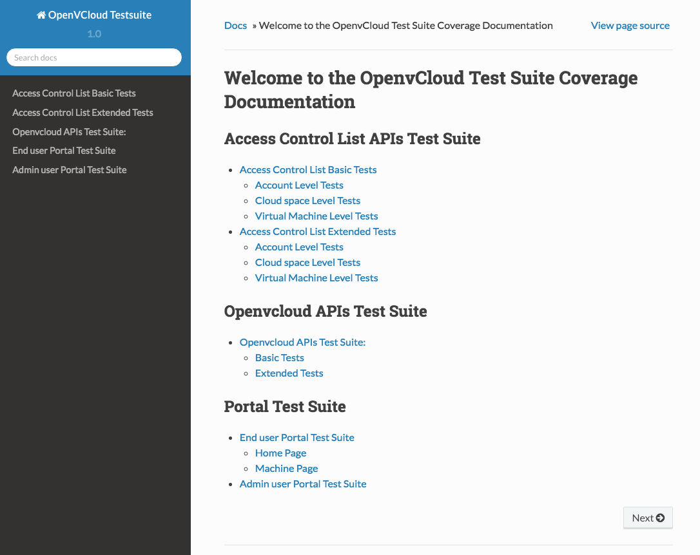

## Setup a Read the Docs site for your Testing Suite

All documentation for following functional tests is embedded in the actual test code:

- [OpenvCloud API Functional Tests](ovc_master_hosted/API/API.md)
- [OpenvCloud Portal Functional Testing](remote_machine_hosted/portal/portal.md)


By following the steps outlined here below you can extracted all the embedded documentation from the actual test code and convert it into a [Read the Docs](http://docs.readthedocs.io/) site using the [Sphinx](https://en.wikipedia.org/wiki/Sphinx_(documentation_generator) documentation generator:


- Make sure that **pip** and **virtualenv** are installed to your system:

  ```
  sudo apt-get install python-pip
  sudo pip install virtualenv
  ```

- Clone the **G8_testing** repository:

  ```
  git clone git@github.com:0-complexity/G8_testing.git
  ```

- Run the build script:

  ```
  cd G8_tests
  bash G8_testing/functional_testing/Openvcloud/tools/build_docs.sh
  ```

- Make sure you have installed a web server, for instance `nginx`:

  ```
  sudo apt-get update
  sudo apt-get install nginx
  ```

- Set the root directory to `_build/html/`, for `nginx` you do that by updating `sites-available/default`:

  ```
  sudo vi /etc/nginx/sites-available/default
  ```

  Change as following:

  ```
  #root /var/www/html;
  root /opt/code/github/G8_testing/auto_generated_docs/_build/html;
  ```      

- Check the configuration change and restart the web server:

  ```
  sudo nginx -t
  sudo systemctl restart nginx
  ```

- Open the generated **index.html** in your browser of choice:

  
